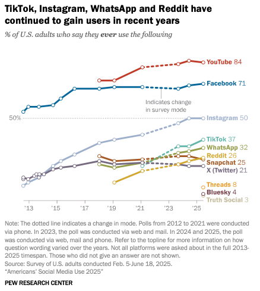
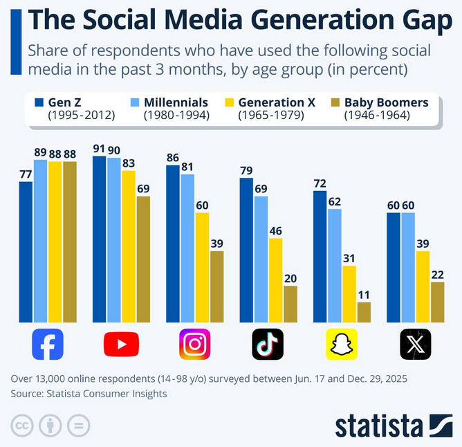
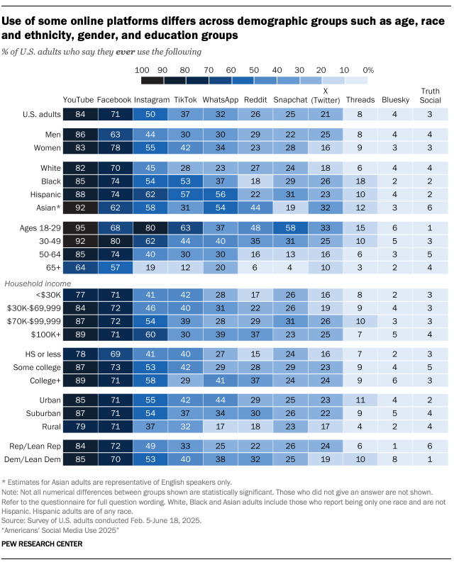

## Overview 

- Identifying sources
- Data acquisition
- Data exploration
- Analysis

## Identifying sources
### Not all social media are equal

- Target audience
- Type of media
- Ease of access 

## Identifying sources
### Target audience

## Identifying sources
### Target audience

## Identifying sources
### Target audience

## Identifying sources
### Type of media

- text/image/video
- short form/long form

## Identifying sources
### Ease of access

- API availability/cost
- gated content
- media types

## Practical social data science
### Sentiment over time surrounding the 2026 Winter Olympics

Download the example code and data: 

<https://github.com/bdsi-utwente/practical-social-data-science>

Feel free to change the research question!

